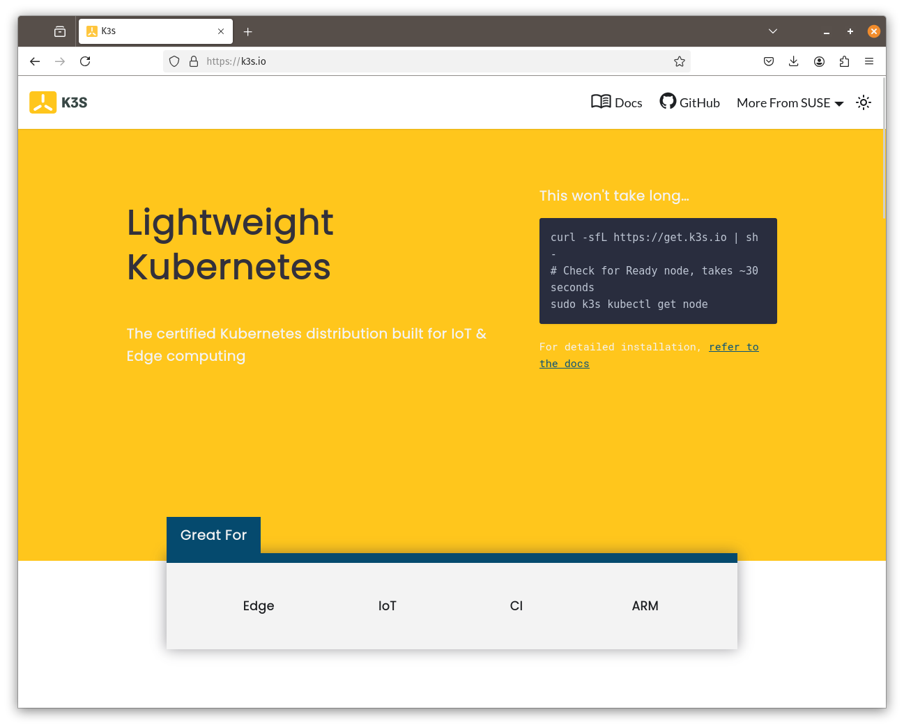
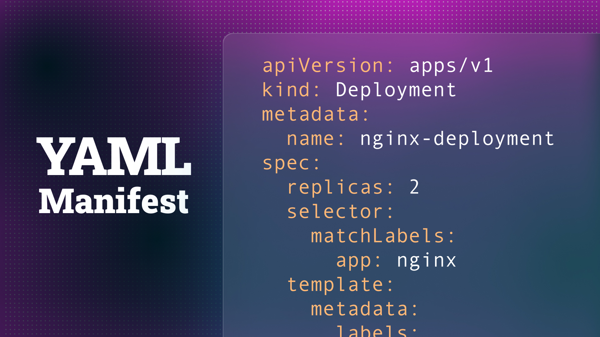
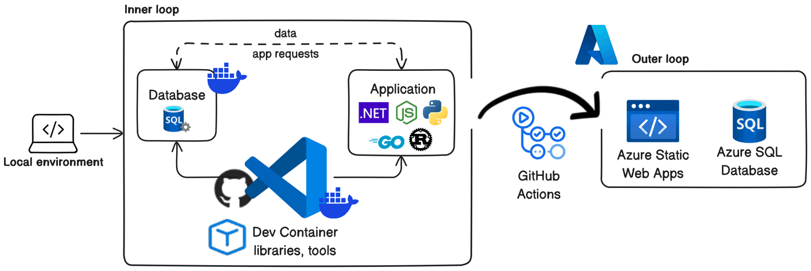
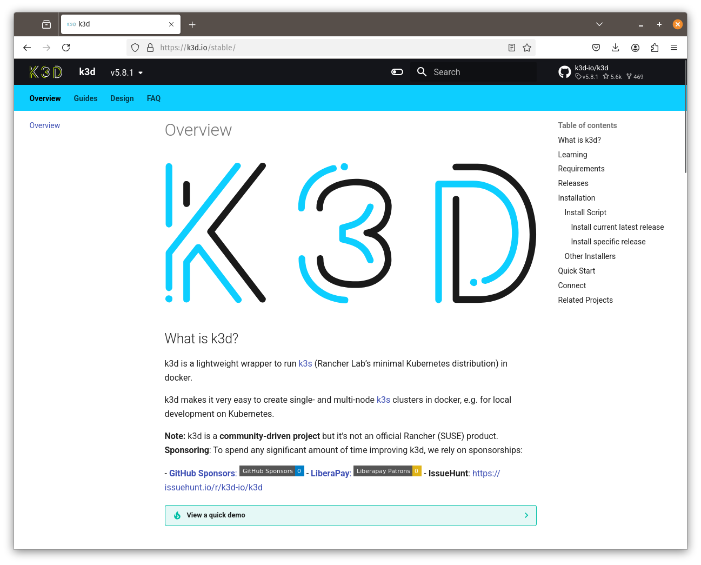

Modern software development can be tricky—especially when your local development environment doesn’t match what runs in production. Enter **Kubernetes**, which can look daunting at first glance (especially with all that YAML). But by integrating Kubernetes into your workflow and combining it with Infrastructure as Code (IaC) best practices, you can **actually** simplify your life in the long run. This article shows how developers can get started on that journey—starting with small K3s setups, moving on to environment-as-code, continuing into CI/CD, and eventually leading to robust, production-ready Kubernetes.

---

## 1. Quick Win: Use K3s on VMs

### K3s for Lightweight, Single-Node (or Small-Cluster) Kubernetes



When people hear “Kubernetes,” they often imagine large, multi-node clusters that require complex setup. **K3s** is a lightweight Kubernetes distribution that lowers the barrier to entry. It’s easy to install on a single virtual machine—on your laptop or in the cloud—and scales up as needed:

- **Minimal Overhead**: K3s is a fully compliant Kubernetes distribution but optimized for resource efficiency.  
- **Single-Node to Multi-Node**: Start on a single VM and add more nodes later if you need.  
- **Simplicity First**: K3s bundles many Kubernetes components, reducing the number of separate services you need to manage.

```sh
sudo curl -sfL https://get.k3s.io | INSTALL_K3S_EXEC='server --disable=traefik --write-kubeconfig-mode="644"' sh -
mkdir -p ~/.kube
cp /etc/rancher/k3s/k3s.yaml ~/.kube/config && sed -i "s,127.0.0.1,$(hostname -I | awk '{print $1}'),g" ~/.kube/config
```

This means you don’t have to commit to a complicated multi-machine cluster right away. You can reap many of Kubernetes’ benefits (such as declarative deployments, container orchestration, and service discovery) on just one small VM—perfect for dev environments, hobby projects, or proofs of concept. 

---

## 2. Infrastructure as Code using YAML



Let’s face it, **YAML** isn’t going to top anyone’s list of favorite languages. Still, it remains a powerful tool for describing and managing systems through **Infrastructure as Code (IaC)**. In the Kubernetes world, YAML is the *lingua franca* for declaring how your clusters, services, and applications should be configured.

1. **Declarative Configuration**  
   You describe *what* you want (for example, “two replicas of my service”), and Kubernetes figures out *how* to achieve it. This shift from imperative scripts to declarative manifests makes your infrastructure easier to understand and maintain.

2. **Environment as Code**  
   By defining your deployments, services, and other resources in YAML—and committing them to version control—you create a single source of truth for your entire system. At any time, you can see exactly which version of the configuration is running and reproduce it in different environments.

3. **Reusability Across Environments**  
   YAML manifests can be reused or adapted to fit local development, testing, staging, and production. Whether you’re using lightweight distributions like K3s or local clusters with K3d, the same YAML definitions can follow you from one environment to the next.

Despite its quirks, YAML offers a **straightforward on-ramp to more robust Infrastructure as Code practices**. As you gain experience, you can layer on tools like Helm or Kustomize without losing the core benefits of declarative, version-controlled configurations.

---

## 3. Dev Environment as Code (a.k.a. DevContainers)



### Why DevContainers?

One of the quickest ways to reduce “but it worked on *my* machine” issues is to define your development environment as code. **DevContainers** (like VS Code DevContainers) let you create a containerized dev environment with your dependencies baked in. This means:

- **Consistent Setup**: Every developer on your team has the same version of runtimes and libraries.  
- **Simple Onboarding**: New team members can start coding quickly—just clone the repo and open the DevContainer.

### But Sometimes You Need Extra Services

Local development rarely stops at your application container; you might need databases, caches, or message queues. You *can* run these with Docker Compose, but if you’re aiming to keep development **as close to production as possible**, it might be time to look at Kubernetes—especially if production is on Kubernetes anyway.

---

## 4. Dev-Prod Alignment with K3d



### Why Not Docker Compose?

Docker Compose is great for orchestrating multiple containers locally, but it doesn’t perfectly match Kubernetes production setups. You’ll miss out on:

- **Service networking and discovery** the same way K8s does it  
- **Rolling updates** and Kubernetes resource definitions  
- **Replicas** and scheduling nuances

### K3d: A Lightweight Local Kubernetes

[K3d](https://k3d.io/) runs a full Kubernetes cluster inside Docker on your local machine. This gives you:

- **Kubernetes in Minutes**: It’s small, lightweight, and fast to start.  
- **Matching Config**: You can reuse the same YAML or Helm charts that you’ll later apply in production.  
- **No Surprises**: Catch issues early because you’re using the same orchestration engine locally as you will in production.

K3d bridges the gap between local development and production, helping you avoid the dreaded “It worked locally but broke in prod” scenario.

---

## 5. CI/CD: Putting It All Together

### Reusing Those Docker Skills

Regardless of the tools you use, building your application inside a Docker container for CI/CD is a **huge** win. The final artifact (the Docker image) is consistent, testable, and deployable across various environments.

### Earthly: One Way to Standardize Builds

[Earthly](https://earthly.dev/) is a build tool that uses Docker containers for everything—local builds, CI builds, and more. This has benefits for developers who are already comfortable with Docker:

1. **Unified CI and Local Builds**: If your CI pipeline fails, you can replicate the same containerized build locally to debug.  
2. **Version Control**: Your Earthly configuration is just another file in your repo—version it, test it, share it.  
3. **Simple, Docker-Focused**: You don’t need to learn a separate DSL (beyond Earthfile syntax), making it simpler for Docker-savvy teams.

In short, Earthly helps ensure your CI/CD is as reproducible as your local setup—both rely on Docker containers under the hood.

---

## 6. Orchestration: Deciding How to Deploy

Once you’ve containerized your applications and standardized your builds, the next question is how to *deploy* them. You have options:

1. **PaaS Services**: Managed services (e.g., Heroku, AWS ECS Fargate) can simplify deployment but may lock you into a specific platform.  
2. **Full Kubernetes**: If you’re already working with K3d (or K3s) and YAML locally, you can deploy the same manifests to a cloud-based Kubernetes cluster. This gives you:
   - **Portability**: Switch clouds or providers more easily.  
   - **Scalability**: Kubernetes can handle large workloads and automatically scale services.  
   - **Consistency**: If your dev environment is on K3d, your production environment can be a near-identical cluster (just bigger or in the cloud).

Since you’re following best practices in your dev environment, you’ll likely find it straightforward to deploy into *any* Kubernetes cluster.

---

## 7. Infrastructure as Code (IaC)

We’ve talked about environment-as-code, but the same principle applies to your underlying infrastructure—servers, networks, IAM policies, and more. While YAML is fine for describing Kubernetes resources, you’ll often need something more flexible and robust for cloud infrastructure. Two popular tools are:

1. **Terraform**: Uses a domain-specific language (HCL). A huge ecosystem of providers, widely adopted in the DevOps world.  
2. **Pulumi**: Lets you write IaC in general-purpose languages like TypeScript, Python, Go, or C#. This can be more powerful if you need advanced logic or if your team already loves a particular programming language.

**Key Benefits of IaC**:  
- **Version Control**: Your entire infrastructure can be pinned to a commit in Git.  
- **Reusability**: Build reusable modules and share them across projects.  
- **Reduced Human Error**: Automated scripts are less error-prone than manual provisioning.

---

## 8. Kubernetes Operators


As you become more advanced in your Kubernetes journey, you might encounter **Operators**. An Operator packages operational knowledge (like how to manage, scale, or heal an application) into a custom Kubernetes controller. Think of it as:

- **IaC on Steroids**: You’re defining not only resources but also *behavior*—self-healing, backups, or upgrades, all automatically handled by the cluster.  
- **Same Language**: With Operator frameworks (like the Operator SDK or KubeBuilder), you can write this logic in Go (or other languages), which you may already be using.  
- **Ease for Complex Services**: If your app has specialized operational tasks, an Operator can handle them for you, in code, so you don’t have to manually run scripts each time.

---

## 9. Summary: A Best Practices Roadmap

1. **Quick Win with K3s**: Start with a lightweight Kubernetes distribution on a VM for your initial cluster—no need for a large multi-node environment right away.  
2. **Dev Environments as Code**: Containerize your development setup to avoid “works on my machine” issues.  
3. **Match Dev and Prod with K3d**: Bring Kubernetes into your local workflow. Reuse the same YAML or Helm charts for local dev and production.  
4. **Containerized CI/CD**: Standardize builds using Docker images; explore tools like Earthly for reproducible pipelines.  
5. **Choose Your Deployment**: With your app containerized and build process automated, pick a PaaS or your own Kubernetes cluster—whichever suits your scale and needs.  
6. **Embrace Infrastructure as Code**: Use Terraform or Pulumi to manage infrastructure changes in a version-controlled, consistent way.  
7. **Consider Kubernetes Operators**: For complex apps with specialized operational tasks, Operators can automate workflows in a language you already know.

**Final Thoughts:**  
- K3s proves Kubernetes doesn’t have to be heavyweight or multi-node to be useful.  
- YAML might feel like extra overhead, but it’s a stepping stone to a fully automated workflow.  
- Dev-prod alignment helps you catch issues early and avoid headaches down the line.  
- Container-based CI/CD ensures you’re shipping consistent artifacts.  
- IaC lays the foundation for easily reproducible, scalable environments.  
- Kubernetes Operators can make advanced automation more accessible by codifying operational logic.

By following these best practices, you’ll transform an initially daunting stack into a **streamlined** system where everything is defined in code, versioned in Git, and deployed with minimal surprises. Kubernetes—and all that YAML—may not be trivial at first, but the payoff in reduced complexity and fewer production catastrophes is well worth the effort.

---

### Ready to Dive In?

- Set up a small VM running [K3s](https://k3s.io/) to get a feel for lightweight Kubernetes.  
- Start containerizing a single service with DevContainers.  
- Spin up a local K3d cluster if you need multi-container orchestration on your laptop.  
- Write your first Terraform or Pulumi config to manage a simple piece of infrastructure.  
- Gradually evolve toward a production-ready Kubernetes environment, possibly leveraging Operators for advanced automation.  

With a bit of practice and some best practices in place, you’ll see why so many teams find Kubernetes indispensable for reducing the *real* complexity in modern software development.