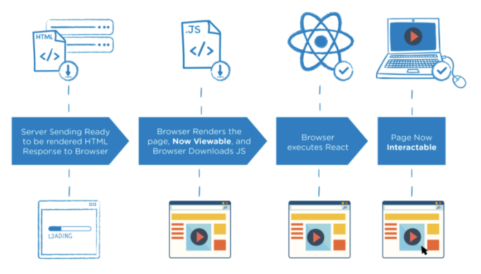
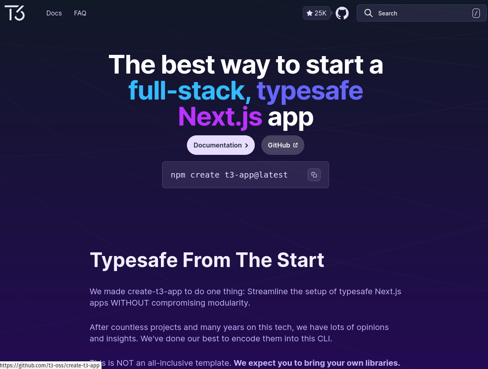
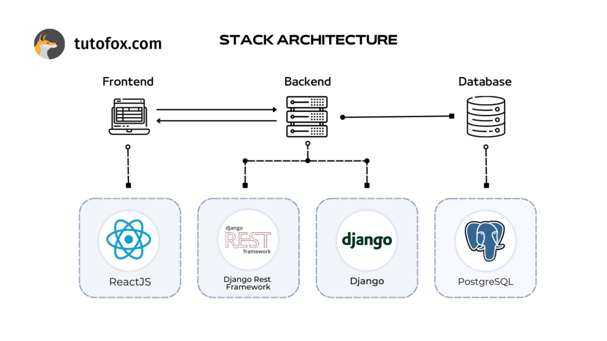
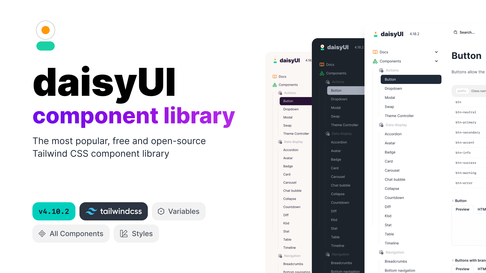

### Introduction

Modern web development offers a spectrum of architectural choices. The most common (and sometimes polarizing) decision is whether to build a **Single-Page Application (SPA)** or a **Multi-Page Application (MPA)**. Traditionally, SPAs fetch data through an API and rely heavily on client-side JavaScript to render and update the UI. MPAs, on the other hand, send fully-formed HTML from the server for every route change, often requiring minimal or no JavaScript on the client.

In this post, we will explore the evolution of React-based architectures (both client and server), discuss how TypeScript simplifies the conversation, dive into what “interactivity” really means, and highlight how libraries like **DaisyUI** and **HTMX**—plus the rise of **web components**—are changing our assumptions about how much JavaScript we truly need.

### The 2 Things That React Fixes (and Where It Falls Short)

1. **Templating sucks, and building components with JSX is better DX**  
   Traditional templating languages often separate HTML structure from logic, making dynamic UI creation verbose and less reusable. React’s JSX, combined with its compositional model, allows you to create reusable, modular components.

   **Example: Traditional Templating (Handlebars with Limited Composition)**  
   ```html
   {{!-- item-list.handlebars --}}
   <ul>
     {{#each items as |item|}}
       <li>
         <a href="{{item.url}}">{{item.name}}</a>
       </li>
     {{/each}}
   </ul>
   ```
   In templating systems like Handlebars, reusability is limited. If you wanted to add logic (e.g., conditionally rendering items), you'd need to add helpers or embed logic within the template, leading to fragmentation.

   **Example: React with JSX and Composition**  
   ```js
   const Item = ({ item }) => (
     <li>
       <a href={item.url}>{item.name}</a>
     </li>
   );

   const ItemList = ({ items }) => (
     <ul>
       {items.map(item => (
         <Item key={item.id} item={item} />
       ))}
     </ul>
   );
   ```

   With JSX, you can break down the UI into smaller, reusable components like `Item`. This allows each part of the UI to encapsulate its own logic and styling, making it easier to test, reuse, and maintain.

   **Example of Extending Composition**  
   Suppose you now want to highlight certain items based on a condition:

   ```js
   const Item = ({ item, isHighlighted }) => (
     <li style={{ fontWeight: isHighlighted ? 'bold' : 'normal' }}>
       <a href={item.url}>{item.name}</a>
     </li>
   );

   const ItemList = ({ items }) => (
     <ul>
       {items.map(item => (
         <Item key={item.id} item={item} isHighlighted={item.isImportant} />
       ))}
     </ul>
   );
   ```

   React’s compositional model lets you extend functionality by passing props (`isHighlighted`) and keeping concerns isolated to specific components.

2. **Some parts of a site need to be dynamic or interactive, and React fixes this**  
   React excels at adding dynamic behavior to web pages, such as updating content in real-time, handling user interactions, and managing component state efficiently. Below is an example that highlights React’s ability to create a dynamic and interactive user experience.

   **Example: A Counter Component with React**  
   ```js
   import React, { useState } from "react";

   const Counter = () => {
     const [count, setCount] = useState(0);

     const increment = () => setCount(prevCount => prevCount + 1);
     const decrement = () => setCount(prevCount => Math.max(prevCount - 1, 0));

     return (
       <div className="p-4 border rounded">
         <h1 className="text-xl font-bold">Counter: {count}</h1>
         <div className="flex gap-2 mt-4">
           <button
             className="btn btn-primary"
             onClick={increment}
           >
             Increment
           </button>
           <button
             className="btn btn-secondary"
             onClick={decrement}
           >
             Decrement
           </button>
         </div>
       </div>
     );
   };

   export default Counter;
   ```

   **Key Features of This Example:**
   - **State Management**: React’s `useState` hook is used to keep track of the `count` value and update it dynamically when buttons are clicked.
   - **Event Handling**: The `onClick` event handlers for the buttons trigger state updates, which automatically re-render the component with the new state.
   - **Real-Time Feedback**: The UI immediately reflects changes in the `count` value without a page reload.

   This kind of real-time interactivity would require more manual effort with traditional templating or server-rendered approaches, involving AJAX calls or page reloads.

### Downsides of React  
While React’s dynamism and interactivity bring significant benefits, it’s important to consider the trade-offs:
- **Performance Overhead**: Even for small components, React requires shipping a runtime and the supporting JavaScript to the client.
- **Complexity**: Managing state across larger applications can require additional libraries (like Redux or Zustand) or advanced patterns, adding to the learning curve.
- **Initial Setup**: Adding React to a project often requires a bundler or build toolchain, making it less straightforward than server-rendered approaches.

### The New Era of Server-Side React




React no longer lives purely on the client. With frameworks like **Next.js**, **Remix**, **Astro**, and others, React can now run on the server, generating HTML that is partially or fully hydrated on the client when necessary. This **Server-Side Rendering (SSR)** approach (also called Universal or Isomorphic React) offers:

- **Faster initial load times**: The user sees HTML right away.  
- **Better SEO**: Content is easily parsed by search engines.  
- **Selective Interactivity**: Choose where, when, and how client-side JavaScript is used (partial hydration or the **islands architecture**).

For many teams, server-side React hits a sweet spot: you get the dynamism of React where you need it, but your app is still primarily served from the server. This drastically reduces how much JavaScript is shipped to the client.

---

### If you're using typescript...




If your language of choice is **TypeScript**, some architectural issues become simpler. With TypeScript, you can:

1. **Use a Node-based server** (e.g. Next.js or Express) for SSR, writing both client and server code in one language.  
2. **Adopt an islands architecture** (like Astro), where you build mostly static or server-rendered pages, and add small interactive “islands” of React (or another framework) only where necessary.

A single language across the stack reduces context-switching and provides type safety across both client and server, making your codebase more robust.

---

### When Do We Actually *Need* Interactivity?



A central question in the SPA vs. MPA debate is **how much client-side interaction do you really need?** Many websites can be rendered on the server for each page request without a noticeable user experience penalty. Often, websites with minimal dynamic behavior—like marketing pages, blogs, or documentation portals—work perfectly well with an MPA pattern and minimal JavaScript.

- **Examples of interactive elements**:
  - Live chat or messaging  
  - Real-time dashboards or data visualizations  
  - Complex forms with inline validation  
  - Drag-and-drop UIs  
  - Media editing tools  
  - Highly customized data filtering/sorting  

If you need these features, client-side JavaScript often becomes essential. But if your site is mostly static content, simple forms, or basic interactions, an MPA could be perfectly sufficient.

---

### Assesing Interactivity using a component library



[DaisyUI](https://daisyui.com/) is built on Tailwind CSS and offers a set of prebuilt, themeable components for layouts, forms, buttons, modals, tabs, and more. Crucially, **it doesn’t rely on JavaScript** for its core functionality.

- **Why does this matter?**  
  - Less JavaScript to ship to the client = better performance.  
  - Fewer potential bugs or security issues from complex JS logic.  
  - You can rely on proven HTML/CSS functionality for many common UI patterns.

If you scan DaisyUI’s components and find that everything you need to build your app is essentially covered by these out-of-the-box CSS-based pieces (or any similar CSS-focused library), **there’s little reason to make an SPA**. An MPA with minimal (or zero) JavaScript can handle your requirements just fine. 

In other words, if your app’s UI can be completely composed from a set of CSS-driven components like those DaisyUI provides, an SPA might be overkill—both in terms of development complexity and bundle size.

---

### HTMX: Sprinkling Interactivity, Minimizing JavaScript

[HTMX](https://htmx.org/) is a library that lets you add dynamic UI updates to a server-rendered app with minimal JavaScript. It intercepts clicks, form submissions, and other events and fetches partial HTML from the server to update parts of the page.

```html
  <!-- Form with HTMX attributes -->
  <form hx-post="/add-item" hx-target="#item-list" hx-swap="beforeend" class="flex gap-2 mb-4">
    <input 
      type="text" 
      name="item" 
      placeholder="Add an item..." 
      class="input input-bordered w-full"
      required
    />
    <button type="submit" class="btn btn-primary">Add</button>
  </form>
```

- **Pros**:  
  - Reduces the need to write custom client-side fetch/axios calls or manage complex state on the client.  
  - Keeps your templates on the server, simplifying SSR.  
  - Can improve performance by only updating small sections of a page, rather than reloading everything.

- **Cons**:  
  - Less control over client-side state compared to a full SPA.  
  - Might require a mindset shift if you’re used to heavily client-side architectures.

HTMX proves that you can achieve a lot of interactivity without writing a ton of JavaScript. It’s ideal for teams wanting more “dynamic” than a static MPA but not the complexity of a typical SPA.

---

### “Just TypeScript!!!” – When You *Really* Need JavaScript

Some applications *do* require robust, client-side logic—maybe it’s a complex single-page analytics dashboard with real-time websockets, drag-and-drop, or advanced data visualizations. In those scenarios:

1. Building an MPA would introduce constant full-page reloads and a disjointed user experience.  
2. A framework like React, Vue, or Svelte provides rich client-side state management and reactivity.

If that’s your situation, it’s perfectly valid to use more JavaScript (or TypeScript to ensure type safety). Just be mindful of performance and bundle sizes, loading only what’s truly necessary.

---

### Web Components: Another Option for Interactivity

**Web Components** (e.g., using [Lit](https://lit.dev/)) are standard-based, reusable UI elements that work in both MPAs and SPAs. You define custom elements that encapsulate their own styles and logic.

- **Why consider web components?**  
  - Framework-agnostic: integrate them in React, Vue, or plain HTML.  
  - Potentially smaller and more focused bundles, especially if you only need a few interactive components.  
  - Easily distributed or reused across multiple projects.

Web components allow you to add bits of interactivity in an otherwise server-rendered or MPA architecture without having to adopt a full front-end framework.

---

### Conclusion: SPA or MPA? The Answer Is Often “It Depends.”

When deciding between a Single-Page Application and a Multi-Page Application, the key is to **evaluate your actual needs**:

1. **High interactivity** (e.g., real-time features, complex UIs) often justifies an SPA—potentially with SSR for performance and SEO.  
2. **Mostly static pages** with a bit of dynamic content can thrive on an MPA with minimal JavaScript, possibly aided by libraries like HTMX or server-rendered frameworks.  
3. **Hybrid approaches** (e.g., islands architecture, partial hydration) blend the best of server rendering and selective client-side interactivity.  
4. **CSS-driven** component libraries (like DaisyUI) or transitions alone can create polished, interactive UIs without the overhead of an SPA.  
5. **Web components** let you sprinkle client-side logic without overcommitting to a particular framework.

Ultimately, **start by looking at what your project truly needs**. Don’t pick an SPA just because it’s trendy, and don’t force an MPA solely to avoid JavaScript. Modern tooling offers multiple ways to find the right balance, from SSR with partial hydration to minimal-JS libraries and beyond. Build in the simplest way that meets your app’s requirements—your users (and your dev team) will thank you.

**Happy building!** 