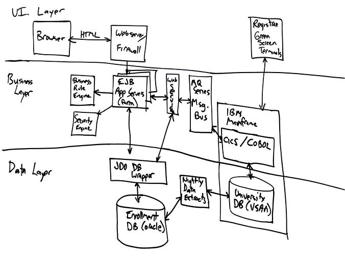
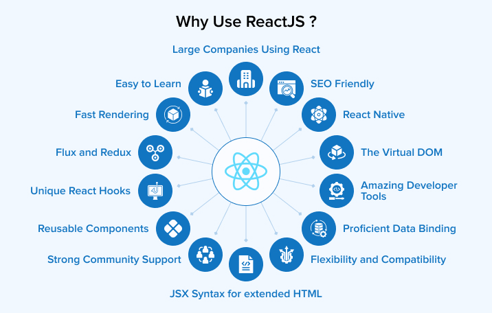
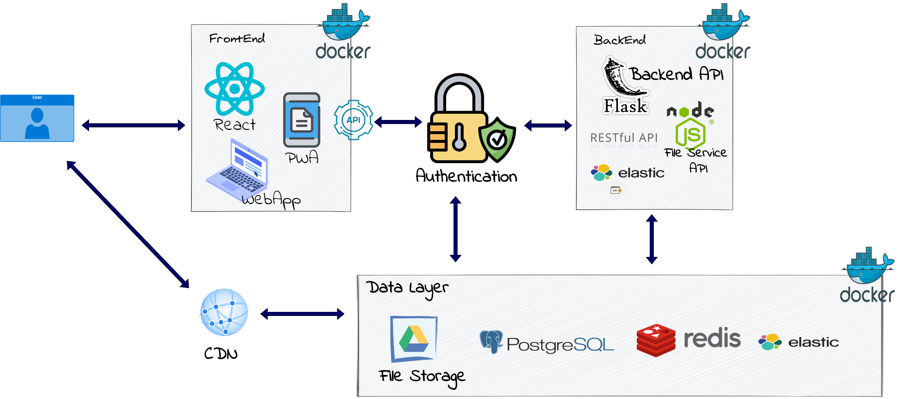
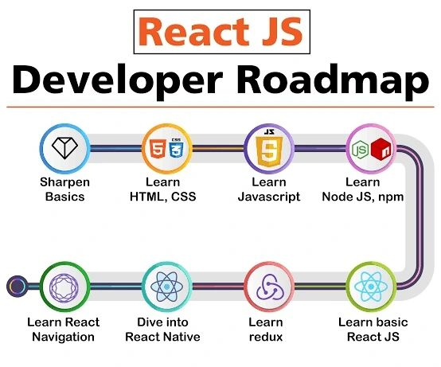
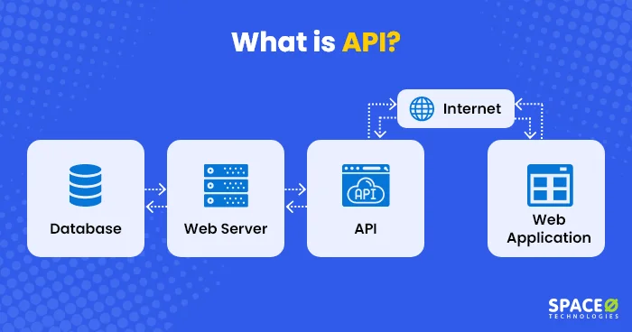
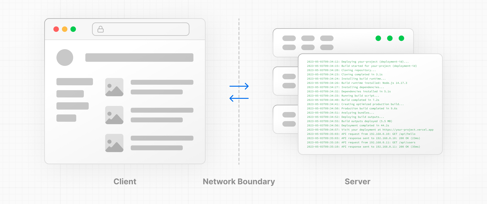

## A Whiteboard Architecture

When architects and developers gather to sketch a system on a whiteboard, the front end often appears as a small rectangle at the top, while the backend occupies most of the space. **Visually**, it suggests that the backend requires the bulk of the effort, with only minimal work on the UI. This can lead to a **resource allocation** where you hire three backend developers but only one UI developer.

However, this is **misleading** because modern front ends have grown in complexity. They frequently include their own state management, component lifecycles, and performance considerations. Underestimating the UI layer risks neglecting user experience, developer productivity, and the long-term maintainability of your application.

---

## Just Use React

Once the project transitions to UI development, a common response is: **“Just use React.”** While React is a popular choice for building rich interfaces, it doesn’t automatically simplify the rest of your architecture. Instead, you may find yourself **juggling multiple codebases** for the front end and the backend, each with its own **deployment pipeline** and technology stack.

For instance, if your backend uses microservices and your front end is a standalone React app, you need to manage routing, communication patterns (often REST or GraphQL), and authentication across these layers. Despite React’s strength for building user interfaces, a **backend-first** approach can still lead to a disjointed architecture where the UI code is treated as an afterthought.

---

## Problem #1 – Duplication

When you separate the front end and backend into distinct projects, you risk **duplicating** tools, processes, and even logic. This duplication can increase maintenance overhead and slow down development over time.

### Duplicate Build Systems

- **Backend:** Might use Maven, Gradle, or a Node-based build process.  
- **Front End:** Typically relies on npm or Yarn with Webpack, Vite, or a similar bundler.  

Each system has its own configuration files, plugins, and scripts for **continuous integration and deployment**. This means you must maintain two separate build pipelines and ensure they work harmoniously with each other.

### Duplicate Package Management

- **Backend:** Depends on language-specific package managers (Maven, pip, etc.).  
- **Front End:** Depends on JavaScript tooling (npm, Yarn).  

With each environment needing updates and security patches, your development team must handle **two sets of dependencies**. This can lead to confusion, version mismatches, or duplication in package functionalities.

### Duplicate Logic and Types

- **Validation:** You might validate user input in React for quick feedback, then repeat the same validation on the backend for security.  
- **Data Models:** If you define user or product data models in both places, a small change in the backend could break the front end if not updated consistently.  
- **Utilities:** A date-formatting function might live in both codebases, each potentially differing in subtle ways.

**Example:** A team building an e-commerce platform might define a `Product` interface in both the Node backend (using JavaScript or TypeScript) and the React front end. If the `price` field changes from `number` to a more complex `object`, developers must remember to update both codebases or risk runtime errors.

---

## Problem #2 – Incorrect Sizing

The **UI layer** is not as small or simple as the whiteboard diagram might suggest. React-based applications require decisions about state management, routing, performance optimizations, and more. There’s also the matter of **user experience**, where a great deal of attention goes into designing intuitive interfaces, ensuring accessibility compliance, and managing UI performance.

In practice, it’s not uncommon for **front-end work** to demand as much time or more than the backend. This can lead to an **imbalanced resource allocation** if you’ve assumed the front end would be a trivial portion of the project. Overlooking the complexities of the UI may result in rushed features, poor user engagement, and high technical debt in the long run.

---

## Problem #3 – Impedance Mismatch

Once you split the front end and backend, you **must define an API** that handles communication between the two. This introduces new questions about protocol choices (REST, gRPC, GraphQL) and how to manage **authentication, data formats, and versioning**.

- **API Contracts:** You need to maintain consistent data structures and endpoints across releases.  
- **Data Shaping:** The backend might provide data in formats that aren’t directly compatible with front-end requirements, forcing you to write additional transformers or adapters.  
- **Auth & Security:** Handling sessions or tokens can become more complicated when your front end and backend are developed and deployed separately.

This extra layer can be appropriate for large, **microservice-oriented** systems. But for smaller or more internally focused projects, it might add **unnecessary complexity** that slows down development.

---

## Modern React is Actually Rather Good

Modern frameworks like **Next.js**, **Remix**, and others allow you to integrate the server and client more closely. When **TypeScript** is used throughout, you can share types, models, and even validation logic. This reduces the risk of **data mismatches** and cuts down on duplicate code.

**Key Benefits of a Unified Approach:**

1. **Shared Data Models:** One set of TypeScript interfaces for both server and client.  
2. **Streamlined Build:** Fewer build systems to maintain when you can run the server and client from a common pipeline.  
3. **Improved Developer Experience:** Debugging and testing can be simpler when all code lives in one place, reducing the complexity of coordinating multiple repositories.

---

## Conclusion

An architecture that heavily emphasizes the backend while minimizing the UI can cause **duplication**, **misallocation of resources**, and **increased complexity**. Modern front ends require careful consideration of **state management**, **performance**, and **user experience**—all of which demand time and expertise.

By **acknowledging** the true complexity of UI development from the start, you can avoid an under-resourced front end and reduce the overhead of maintaining separate systems. Instead of simply saying **“Just use React,”** consider integrating your front end and backend more tightly, sharing data models and build processes whenever possible. This balanced approach leads to **faster development**, **fewer errors**, and **happier users** in the long run.