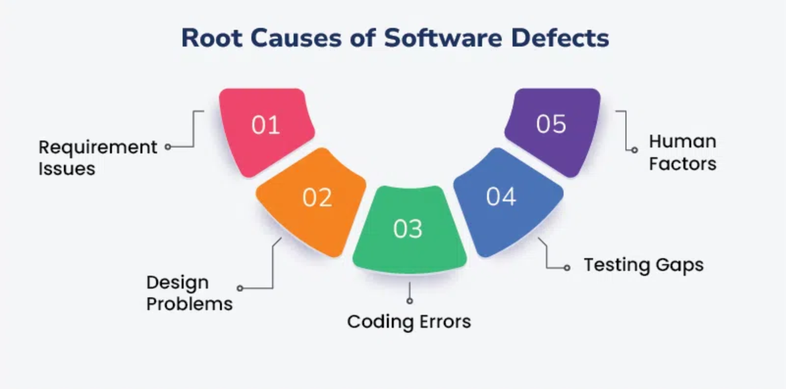
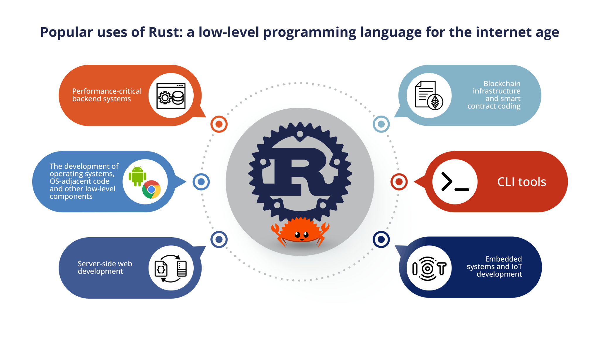

# Stop Saying Rust Is Complicated

Rust often gets labeled as “too hard” or “too complicated” because it forces you to think carefully about memory, concurrency, and error handling. But here’s the catch: those aren’t just “Rust problems.” They’re *software engineering* problems that show up in any sufficiently complex system. Rust’s approach may feel strict, but it’s essentially teaching you fundamental best practices that lead to more reliable, maintainable code. Let’s break down why.

## 1. It’s Not Rust; It’s Software Engineering


Rust includes many features—like `Option<T>`, `Result<T, E>`, *traits*, algebraic data types (ADTs), and RAII—that people sometimes describe as “complicated.” But these concepts aren’t unique to Rust; they’re borrowed or refined from decades of programming language research and practice. In other words, **Rust is simply packaging essential software engineering concepts into the language, making them hard to ignore**.

Here’s a quick rundown of some key “Rust features” and where they came from:

1. **`Option<T>` & `Result<T, E>`**  
   - **Influence**: ML/Haskell’s `Maybe` and `Either`, plus error-handling paradigms in other functional and systems languages.  
   - **Why It Matters**: These types *force* you to handle cases where data may be missing or operations can fail, preventing null-pointer exceptions and unhandled errors.

2. **Algebraic Data Types (ADTs) & Pattern Matching**  
   - **Influence**: ML, Haskell, Scala  
   - **Why It Matters**: Rust’s `enum` is an ADT that can have multiple variants. Coupled with `match`, it compels you to consider every possible variant in your code, preventing subtle bugs.

3. **Traits (Inspired by Type Classes)**  
   - **Influence**: Haskell’s type classes  
   - **Why It Matters**: *Traits* let you define shared behavior across types without traditional inheritance. This promotes loose coupling and clear contracts, which is a cornerstone of robust design.

4. **RAII (Resource Acquisition Is Initialization)**  
   - **Influence**: C++  
   - **Why It Matters**: Rust automatically frees resources (memory, file handles, etc.) when they go out of scope. This makes resource management deterministic and prevents many classes of memory leaks.

5. **Move Semantics & Borrowing**  
   - **Influence**: C++ (move semantics), Cyclone, plus Rust’s own ownership rules  
   - **Why It Matters**: Rust enforces strict ownership and borrowing constraints, preventing data races and dangling references at compile time.

6. **Zero-Cost Abstractions**  
   - **Influence**: C++  
   - **Why It Matters**: Rust’s abstractions (e.g., iterators, generics, closures) don’t add extra runtime overhead compared to handwritten low-level code, encouraging both readability *and* performance.

7. **Concurrency**  
   - **Influence**: Various concurrency models (Erlang, Go, functional languages)  
   - **Why It Matters**: Rust’s strict aliasing and ownership rules make concurrency mistakes hard to compile, leading to “fearless concurrency” and fewer data races.

### Example: Go vs. Rust in Handling “No Value”

Let’s see how one of these features—`Option<T>`—compares to a more traditional approach using Go’s `nil`.

#### Go
```go
// Suppose we have a function that might return nil
func getUser(id int) *User {
    if id == 1 {
        return &User{Name: "Alice"}
    }
    return nil
}

func main() {
    user := getUser(2)
    if user == nil {
        fmt.Println("User not found!")
        return
    }
    // Must check for nil *again* if we pass user around, or risk panic
    fmt.Println("User:", user.Name)
}
```
In Go (and many other languages), it’s up to *you* to remember to check `nil` everywhere. Miss a check, and you could trigger a runtime panic or crash.

#### Rust
```rust
enum User {
    // Imagine a more complex struct
    Alice(String),
}

fn get_user(id: u32) -> Option<User> {
    if id == 1 {
        Some(User::Alice("Alice".to_string()))
    } else {
        None
    }
}

fn main() {
    let maybe_user = get_user(2);
    match maybe_user {
        Some(user) => println!("User: {:?}", user),
        None => println!("User not found!"),
    }
}
```
Rust’s `Option<T>` type forces you to *explicitly* handle the “no value” case (`None`). There’s no possibility of forgetting it or having a null-pointer exception sneak through into production.

> **Bottom line**: Rust isn’t making your life harder; it’s making sure you don’t accidentally ignore fundamental software engineering best practices (like proper error handling and safe resource management).

---

## 2. It’s a Learning Curve or Bugs in Production



Yes, Rust makes you jump through hoops for error handling (`Result<T, E>`), memory safety (ownership and borrowing), and concurrency. But if you’re *not* doing these checks in other languages, the bugs don’t magically disappear; they just lurk in your code, waiting to manifest at the worst possible time (like in production).

- **Memory leaks and data races**: In C or C++, you can inadvertently leak memory or cause data races, relying on code reviews and testing to (hopefully) catch them. Rust’s ownership system *automates* this checking at compile time.  
- **Null pointer exceptions**: Languages like Go, Java, or JavaScript often run into `nil` or `undefined` issues. Rust’s `Option` type eliminates that entire class of bugs by design.

> **Would you rather** spend a few extra minutes satisfying the compiler’s requirements, or spend hours debugging random crashes and production issues?

---

## 3. You Get This For Free



Once you wrap your head around Rust’s approach, you get a ton of benefits “for free”:

- **General-Purpose Usage**: Rust isn’t just for systems programming. It’s used in:
  - **Embedded devices** (e.g., microcontrollers, IoT)
  - **Full-stack web** (e.g., Actix, Rocket, WebAssembly on the frontend)
  - **AAA games**, graphics, high-performance computing
- **Performance**: Rust’s zero-cost abstractions mean you don’t pay for features you don’t use. You can write code that’s as fast as C or C++ but with fewer memory pitfalls.

A single language can handle low-level embedded work, high-level web services, and everything in between—all while ensuring you don’t ship half-baked bugs into production.

---

## 4. “Yeah, But Lifetimes?”

Let’s address the big elephant in the room: *lifetimes*. Yes, they can look scary in function signatures. However, most Rust developers will tell you that over the past few years, the compiler has gotten *much* better at inferring lifetimes automatically. You’ll rarely need to annotate them manually unless you’re writing very generic or complex code.

### What Are Lifetimes, Briefly?

In short, **lifetimes** ensure references never outlive the data they point to. For example, if you try to return a reference to a local variable, that reference would be invalid once the function ends. Rust’s borrow checker will reject that code. Lifetimes are the mechanism that says: “This reference can only exist as long as the data it references is valid.”

> **Translation**: Rust ensures you don’t have dangling pointers. The compiler forces you to specify (or rely on inferred) lifetime relationships when it can’t figure them out automatically.

---

## 5. It’s More Important Than Ever


With the rise of AI-assisted coding (Copilot, ChatGPT, etc.), we’re generating more code automatically. That’s convenient, but it also means we risk injecting subtle bugs into production without a second thought. A strong type system—one that enforces ownership, borrowing, and explicit error handling—is your safety net.

- **AI-generated code** can be logically correct but still miss real-world edge cases.  
- **Rust’s compiler** systematically enforces invariants, saving you from entire categories of potential bugs.

In an era where coding is becoming more automated, having a language that “stands in your way” (for the right reasons) becomes a *huge* advantage.

---

## Conclusion

Rust isn’t “too complicated”—it’s just *intentionally strict*. It’s a language that wraps core software engineering best practices—like handling null values properly, preventing memory corruption, and enforcing deterministic cleanup—into the compiler. Yes, there’s a learning curve, but the alternative is shipping code to production with hidden booby traps.

So the next time someone says Rust is “too complex,” remind them it’s not Rust—it’s just **good software engineering**. Once you get the hang of it, you’ll wonder why you ever tolerated anything less.