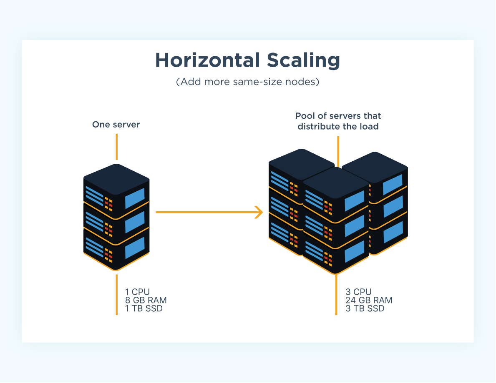
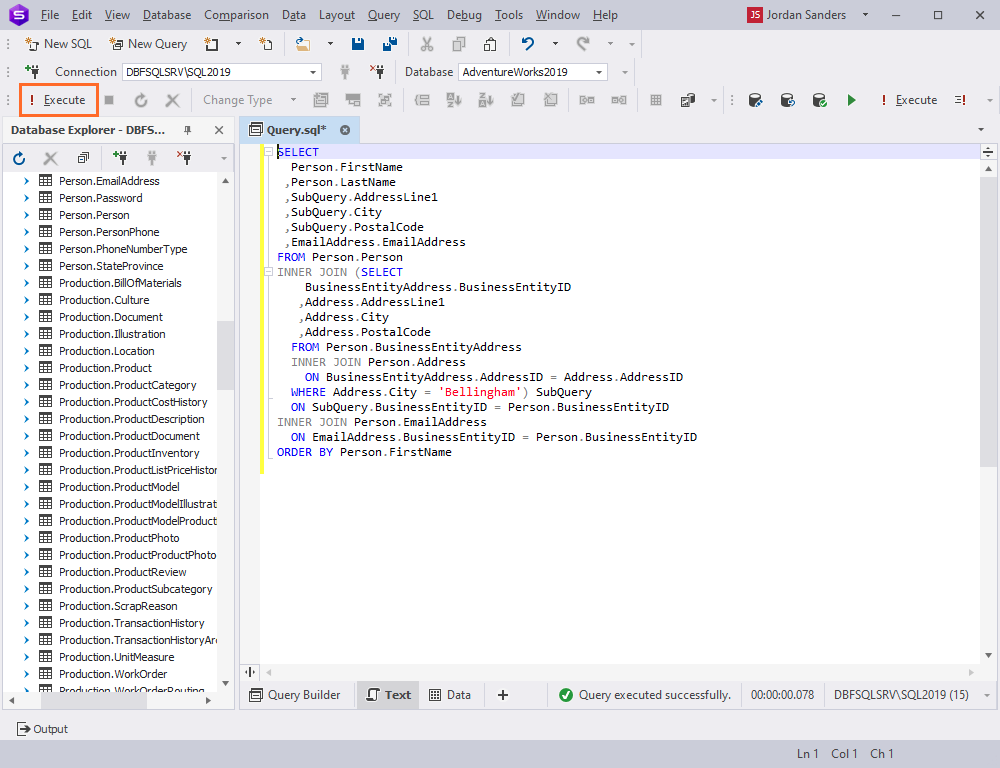
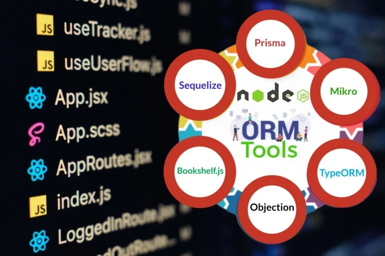

**SQL vs. NoSQL: Key Factors Architects Should Consider**

When choosing between SQL and NoSQL databases for your application, it’s tempting to focus on a couple of primary considerations: **how you want to store your data** and **whether horizontal scaling is required**. While these are essential questions, there are several other factors that architects should evaluate early in a project to ensure the database choice aligns with the application’s needs both now and in the future.

Here’s a comprehensive guide to the critical factors to consider:

---

### **1. How Do You Want to Store Your Data?**
- **SQL Databases**: Use a predefined, rigid schema to enforce structure, making them ideal for highly relational and structured data.
- **NoSQL Databases**: Offer flexible schemas, allowing for unstructured or semi-structured data, such as JSON or key-value pairs.
- **Hybrid Approaches**: Modern SQL databases like **PostgreSQL** allow for hybrid storage by supporting JSON/JSONB, providing the flexibility of schema-less NoSQL while retaining the power of traditional relational modeling. This makes it possible to combine structured and unstructured data within the same database.

**Real-World Example:**
- **PostgreSQL** is often used by organizations needing both structured data (e.g., user profiles) and unstructured data (e.g., logs or configurations stored as JSON). For instance, an e-commerce platform might store customer orders relationally while keeping flexible product metadata in JSONB fields.

**Architect’s Consideration:**
- Are you willing to give up the benefits of using a structured approach?

---

### **2. Do You Need Horizontal Scaling?**

- **SQL**: Can scale horizontally with techniques like sharding or tools like Vitess (for MySQL) and Citus (for PostgreSQL), though it’s often more complex.
- **NoSQL**: Designed with horizontal scaling in mind, often offering built-in mechanisms for sharding and distributing data.

**Real-World Example:**
- **Twitter**: Uses MySQL for user and tweet data but implements horizontal scaling with sharding based on user ID ranges. This allows them to handle billions of tweets efficiently while keeping queries fast.

**Architect’s Consideration:**
- Will the application’s data volume or throughput exceed what a single node can handle? If so, plan for horizontal scaling. Both types of database have solutions for this.

---

### **3. Consistency vs. Availability (CAP Theorem)**
- **SQL**: Prioritizes consistency with strong ACID guarantees, ensuring data correctness.
- **NoSQL**: Often focuses on availability and partition tolerance, offering eventual consistency for distributed systems.

**Real-World Example:**
- **Banking Systems**: Banks rely on SQL databases like Oracle or PostgreSQL for transaction processing, where strong consistency is critical to ensure financial accuracy.
- **Social Media Platforms**: Platforms like Instagram use eventual consistency for likes and comments, allowing data to sync across regions while maintaining high availability.

**Architect’s Consideration:**
- Does the application require strong consistency (e.g., financial systems) or eventual consistency (e.g., social media feeds)?

---

### **4. Query Complexity**

- **SQL**: Supports complex queries involving joins, aggregations, and multi-table relationships.
- **NoSQL**: Best suited for simpler, high-performance queries but may require additional workarounds for complex queries.

**Real-World Example:**
- **Reporting Systems**: Companies like Salesforce rely on SQL databases for generating reports involving multiple tables with complex joins and aggregations.
- **NoSQL for Simplicity**: E-commerce platforms might use MongoDB for quick lookups of product catalogs where data is stored in a denormalized, document-oriented format.

**Architect’s Consideration:**
- Will the system require complex relational queries, or are the queries relatively straightforward?

---

### **5. Data Growth and Volume**
- **SQL**: Manages moderate growth with indexing, partitioning, and replication.
- **NoSQL**: Excels with high-volume, rapidly growing datasets such as logs, IoT data, or real-time analytics.

**Real-World Example:**
- **IoT Systems**: Platforms like Fitbit use NoSQL databases like Cassandra to handle massive streams of sensor data from millions of devices.
- **Traditional ERP Systems**: Enterprises managing moderate data growth rely on SQL databases like SAP HANA or PostgreSQL for structured data.

**Architect’s Consideration:**
- What is the anticipated data growth rate, and is it structured, semi-structured, or unstructured?

---

### **6. Write/Read Patterns**
- **Write-Heavy Workloads**: NoSQL databases handle high-throughput writes effectively.
- **Read-Heavy Workloads**: SQL databases combined with read replicas and caching excel for read-intensive applications.

**Architect’s Consideration:**
- Is the workload read-heavy, write-heavy, or balanced?

---

### **7. Schema Evolution**
- **SQL**: Schema changes (e.g., adding columns) can be time-consuming and may lock large tables during migrations.
- **NoSQL**: Flexible schemas allow easy changes without downtime.

**Architect’s Consideration:**
- Will the schema remain stable, or is it likely to evolve frequently? If frequently will database locks be an issue.

---

### **8. Ecosystem and Tools**

- **SQL**: Mature ecosystem with robust tools for analytics, migrations, and optimization.
- **NoSQL**: Offers tools optimized for specific use cases, like MongoDB Atlas for clustering.

**Architect’s Consideration:**
- What tools will your team need for development, debugging, and monitoring?

---

### **9. Developer and Operational Expertise**

- **SQL**: Familiar to most developers, with a well-established knowledge base.
- **NoSQL**: May require specialized skills for schema design, query optimization, and operations like re-sharding.

**Architect’s Consideration:**
- Does your team have the necessary expertise, or will additional training be required?

---

### **10. Cost**
- **SQL**: Vertical scaling can become expensive; horizontal scaling may require additional tools.
- **NoSQL**: Lower infrastructure costs for certain use cases but may require more development effort.

**Architect’s Consideration:**
- What is the budget for the project, including licensing, infrastructure, and maintenance?

---

### **11. Transactional Requirements**
- **SQL**: Excels with multi-row transactions and ACID guarantees.
- **NoSQL**: Limited or eventual transaction guarantees (though some NoSQL databases, like MongoDB, now support ACID transactions within a single shard).

**Architect’s Consideration:**
- Does the application require strong transactional consistency?

---

### **12. Long-Term Maintenance**
- **SQL**: Well-documented maintenance practices for backups, migrations, and upgrades.
- **NoSQL**: May introduce complexities like re-sharding, replica synchronization, or managing eventual consistency.

**Architect’s Consideration:**
- How much operational overhead can your team handle?

---

### **13. Integration with Analytics and BI**

- **SQL**: Integrates easily with reporting and analytics tools.
- **NoSQL**: Often requires additional pipelines or custom solutions for analytics.

**Architect’s Consideration:**
- Does the application need strong analytical capabilities, or is it primarily transactional?

---

### **14. Vendor Lock-In**
- **SQL and NoSQL**: Proprietary systems like DynamoDB or CosmosDB may lock you into a specific vendor’s ecosystem, while open-source options like PostgreSQL and MongoDB offer greater flexibility.

**Architect’s Consideration:**
- Will vendor lock-in impact long-term flexibility and cost?

---

### **15. Geographic Distribution**
- **SQL**: Requires manual setup for multi-region deployments, such as replication.
- **NoSQL**: Distributed databases like Cassandra or Spanner natively support multi-region scaling.

**Architect’s Consideration:**
- Does your application require low-latency access across multiple regions?

---

### **How PostgreSQL Meets Most Requirements (and Where It Doesn't)**

PostgreSQL has evolved into a versatile database capable of addressing a wide range of architectural needs. Here’s how it performs against the factors discussed:

- **Structured and Unstructured Data:** PostgreSQL supports both relational data and JSON/JSONB for document-like flexibility, making it ideal for hybrid use cases.
- **Horizontal Scaling:** Tools like Citus allow PostgreSQL to scale horizontally, though it requires additional setup compared to NoSQL databases that provide built-in sharding.
- **Consistency and Transactions:** PostgreSQL excels with strong ACID guarantees, ensuring consistency for mission-critical applications like financial systems.
- **Query Complexity:** It handles complex queries with ease, making it suitable for reporting, analytics, and relational data management.
- **Ecosystem and Tools:** PostgreSQL integrates seamlessly with a mature ecosystem of analytics, ETL, and BI tools.
- **Read/Write Workloads:** While read-heavy workloads can be optimized with read replicas, write-heavy workloads may require careful tuning or sharding for scalability.
- **Geographic Distribution:** Multi-region deployments are possible but not as seamless as with distributed NoSQL databases like Cassandra or Spanner.

**Where PostgreSQL May Fall Short:**
- For applications requiring massive horizontal scalability or built-in geographic distribution, NoSQL databases like MongoDB or Cassandra may be a better fit.
- Eventual consistency and ultra-low-latency global access may favor NoSQL or specialized distributed databases.

### Conclusion

Ultimately, there’s no one-size-fits-all solution. PostgreSQL is a strong default choice for many applications, offering flexibility and scalability that meet most requirements. 

Additionally, using PostgreSQL does not preclude the future option of moving specific columns or datasets to a NoSQL database if new requirements arise.
