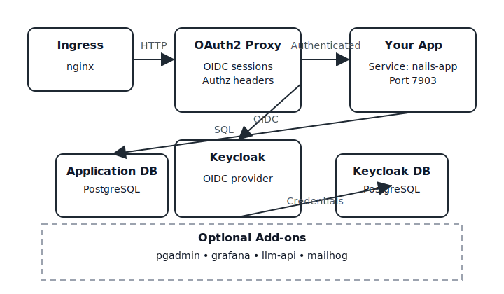

# Deployed Application Topology

Rust on Nails ships an opinionated set of Kubernetes workloads that surround your application with
the services it needs. The operator provisions the platform pieces; you deploy your own web
application. This page walks through how the moving parts fit together so you know where requests
travel, which workloads own authentication, and how state is managed.

## Traffic Flow

1. **Ingress Controller (nginx)** terminates HTTP, applies buffer limits, and forwards all traffic
   for the application domain into the cluster.
2. **OAuth2 Proxy** guards the application surface area. Requests are authenticated with Keycloak
   using the OpenID Connect flow. Authenticated requests are forwarded to the main app service.
3. **Your Nails Application** serves the UI and APIs. Deploy it as a Kubernetes `Service` named
   `nails-app` on port `7903` so the surrounding components can reach it. The app reads and writes
   application data through the PostgreSQL cluster that the operator manages.
4. **Keycloak** performs the identity workflow for both end users and administrators. OAuth2 Proxy
   relies on it for session validation and token issuance.

## Core Services

- **nails-app** – Your Rust web application. Publish it with a `Service` named `nails-app`
  targeting port `7903`. Handle your own deployment spec, migrations, and configuration; the
  supporting services expect to find this endpoint.
- **oauth2-proxy** – Handles login, session cookies, and passes authenticated requests to
  `nails-app`. It no longer relies on an Envoy sidecar; upstreams target the app service directly.
- **keycloak-service** – Manages user identities, realms, and clients. The operator provisions a
  dedicated PostgreSQL instance for Keycloak alongside the application database.
- **database** / **keycloak-db** – Stateful PostgreSQL instances exposed in-cluster. Credentials are
  wired into the application and Keycloak via Kubernetes secrets.

## Optional Add-ons

Depending on the CRD flags set for your `NailsApp`, the operator may also roll out:

- **pgadmin** – Browser-based database administration UI bound behind the main ingress.
- **grafana and observability stack** – Adds dashboards and metrics when observability is enabled.
- **llm-api** – Ships the Rust on Nails AI helper service.
- **mailhog** – Captures outbound email in development namespaces.

Each optional component inherits the same network policy defaults as the core services, restricting
ingress to namespace-local traffic (plus the ingress controller) and limiting egress to only the
destinations the workload requires.

## Lifecycle

The operator keeps these workloads in sync with the desired state inside the `NailsApp` CRD. During
an upgrade it reapplies deployments, rotates configuration, and prunes components that were disabled
so the namespace stays tidy.
