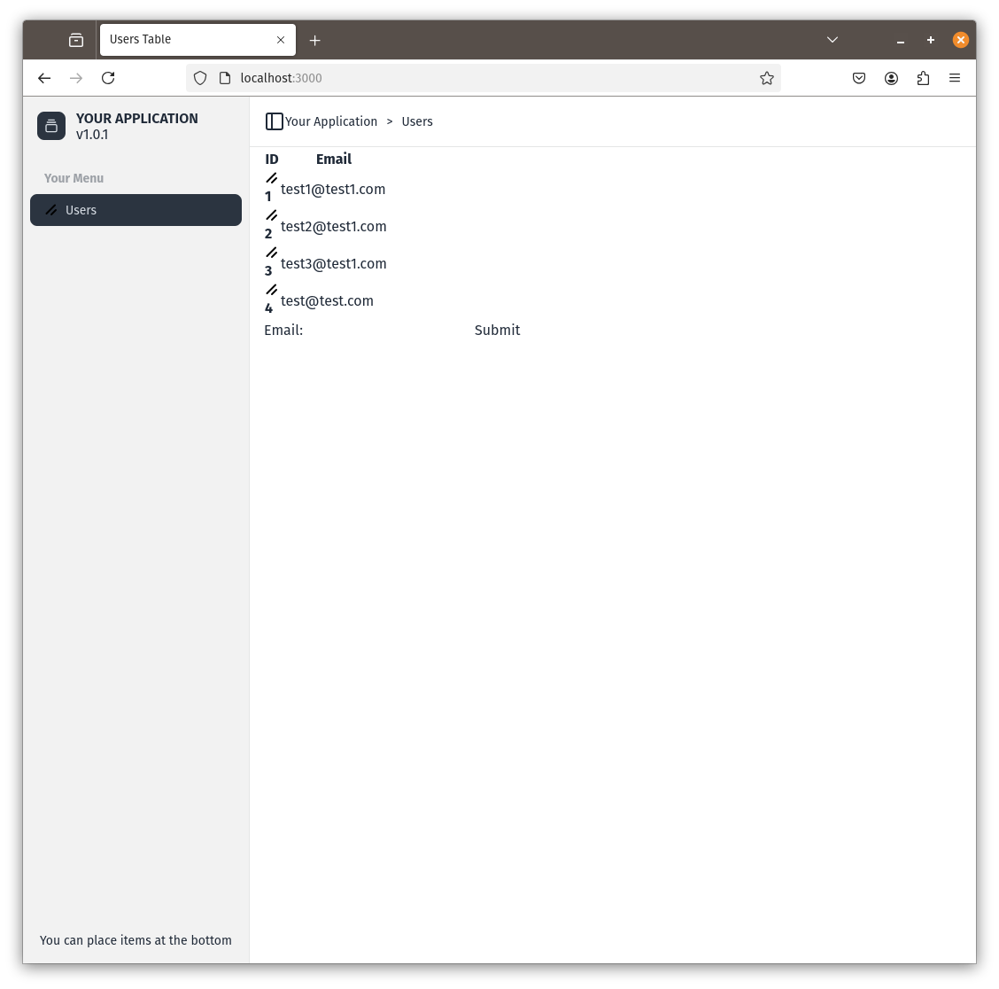

# Building with Components I

One of the main benefits of React is that you can construct user interfaces from components. We can do exactly the same with Dioxus. We'll use a pre-designed set of components called [DaisyUI](https://daisyui.com/) which gives most things we will need i.e. Buttons, Tabs etc.

And we can use [Daisy RSX](https://github.com/bionic-gpt/daisy-rsx/) which is a crate that gives us a wrapper around the Daisy components in RSX.

## Install Daisy UI

Update your `tailwind.config.js` so it looks like the following

```js
/** @type {import('tailwindcss').Config} */
module.exports = {
  content: ["../web-pages/**/*.rs"],
  /** We need this because we use daisy-rsx library */
  safelist: [
    {
      pattern: /avatar*|alert*|modal*|btn*|menu*|dropdown*|badge*|card*|input*|select*|textarea*|label*|tab*|tooltip*|flex*|text*|overflow*/
    }
  ],
  theme: {},
  plugins: [
    require("daisyui"),
    require('@tailwindcss/typography')
  ]
}
```

You should see the daisyUI theme being added.

## Install Daisy RSX

```sh
cd crates/web-pages
cargo add daisy_rsx@0.1
```

## Adding Components

Let's add some components to our `wep-pages/src/layout.rs`.

Replace all the code with the following

```rust
#![allow(non_snake_case)]
use daisy_rsx::*;
use dioxus::prelude::*;
use web_assets::files::*;

#[derive(PartialEq, Clone, Eq, Debug)]
pub enum SideBar {
    Users,
}

impl std::fmt::Display for SideBar {
    fn fmt(&self, f: &mut std::fmt::Formatter) -> std::fmt::Result {
        std::fmt::Debug::fmt(self, f)
    }
}

#[component]
pub fn Layout(title: String, children: Element, selected_item: SideBar) -> Element {
    rsx! {
        BaseLayout {
            title,
            stylesheets: vec![tailwind_css.name.to_string()],
            header: rsx!(
                nav {
                    aria_label: "breadcrumb",
                    ol {
                        class: "flex flex-wrap items-center gap-1.5 break-words text-sm sm:gap-2.5",
                        li {
                            class: "ml-3 items-center gap-1.5 hidden md:block",
                            "Your Application"
                        }
                        li {
                            ">"
                        }
                        li {
                            "Users"
                        }
                    }
                }
            ),
            sidebar: rsx!(
                NavGroup {
                    heading: "Your Menu",
                    content:  rsx!(
                        NavItem {
                            id: SideBar::Users.to_string(),
                            selected_item_id: selected_item.to_string(),
                            href: "/",
                            icon: favicon_svg.name,
                            title: "Users"
                        }
                    )
                }
            ),
            sidebar_header: rsx!(
                div {
                    class: "flex aspect-square size-8 items-center justify-center rounded-lg bg-neutral text-neutral-content",
                    svg {
                        xmlns: "http://www.w3.org/2000/svg",
                        width: "24",
                        height: "24",
                        view_box: "0 0 24 24",
                        fill: "none",
                        stroke: "currentColor",
                        stroke_width: "2",
                        stroke_linecap: "round",
                        stroke_linejoin: "round",
                        class: "lucide lucide-gallery-vertical-end size-4",
                        path {
                            d: "M7 2h10",
                        }
                        path {
                            d: "M5 6h14",
                        }
                        rect {
                            width: "18",
                            height: "12",
                            x: "3",
                            y: "10",
                            rx: "2",
                        }
                    }
                }
                div {
                    class: "ml-3 flex flex-col gap-0.5 leading-none",
                    span {
                        class: "font-semibold uppercase",
                        "Your Application"
                    }
                    span {
                        class: "",
                        "v1.0.1"
                    }
                } 
            ),
            sidebar_footer: rsx!(
                div {
                    class: "text-center text-sm",
                    "You can place items at the bottom"
                }  
            ),
            div {
                class: "px-4 h-full",
                {children}
            } 
        }
    }
}

#[derive(Props, Clone, PartialEq)]
pub struct BaseLayoutProps {
    title: String,
    fav_icon_src: Option<String>,
    stylesheets: Vec<String>,
    js_href: Option<String>,
    header: Element,
    children: Element,
    sidebar: Element,
    sidebar_footer: Element,
    sidebar_header: Element,
}

pub fn BaseLayout(props: BaseLayoutProps) -> Element {
    rsx!(
        head {
            title {
                "{props.title}"
            }
            meta {
                charset: "utf-8"
            }
            meta {
                "http-equiv": "X-UA-Compatible",
                content: "IE=edge"
            }
            meta {
                name: "viewport",
                content: "width=device-width, initial-scale=1"
            }
            for href in &props.stylesheets {
                link {
                    rel: "stylesheet",
                    href: "{href}",
                    "type": "text/css"
                }
            }
            if let Some(js_href) = props.js_href {
                script {
                    "type": "module",
                    src: "{js_href}"
                }
            }
            if let Some(fav_icon_src) = props.fav_icon_src {
                link {
                    rel: "icon",
                    "type": "image/svg+xml",
                    href: "{fav_icon_src}"
                }
            }
        }
        body {
            div {
                class: "flex h-screen overflow-hidden",
                nav {
                    id: "sidebar",
                    class: "
                        border-r border-base-300
                        fixed
                        bg-base-200
                        inset-y-0
                        left-0
                        w-64
                        transform
                        -translate-x-full
                        transition-transform
                        duration-200
                        ease-in-out
                        flex
                        flex-col
                        lg:translate-x-0
                        lg:static
                        lg:inset-auto
                        lg:transform-none
                        z-20",
                    div {
                        class: "flex items-center p-4",
                        {props.sidebar_header}
                    }
                    div {
                        class: "flex-1 overflow-y-auto",
                        {props.sidebar}
                    }
                    div {
                        class: "p-4",
                        {props.sidebar_footer}
                    }
                }
                main {
                    id: "main-content",
                    class: "flex-1 flex flex-col",
                    header {
                        class: "flex items-center p-4 border-b border-base-300",
                        button {
                            id: "toggleButton",
                            svg {
                                xmlns: "http://www.w3.org/2000/svg",
                                width: "24",
                                height: "24",
                                view_box: "0 0 24 24",
                                fill: "none",
                                stroke: "currentColor",
                                stroke_width: "2",
                                stroke_linecap: "round",
                                stroke_linejoin: "round",
                                class: "lucide lucide-panel-left",
                                rect {
                                    width: "18",
                                    height: "18",
                                    x: "3",
                                    y: "3",
                                    rx: "2",
                                }
                                path {
                                    d: "M9 3v18",
                                }
                            }
                        }
                        {props.header}
                    }
                    section {
                        class: "flex-1 overflow-y-auto",
                        {props.children}
                    }
                }
            }
        }
    )
}
```

We've added (amongst other things) `NavGroup` and `NavItem` components that give us a nice looking side menu.

You should now have something like the following.

