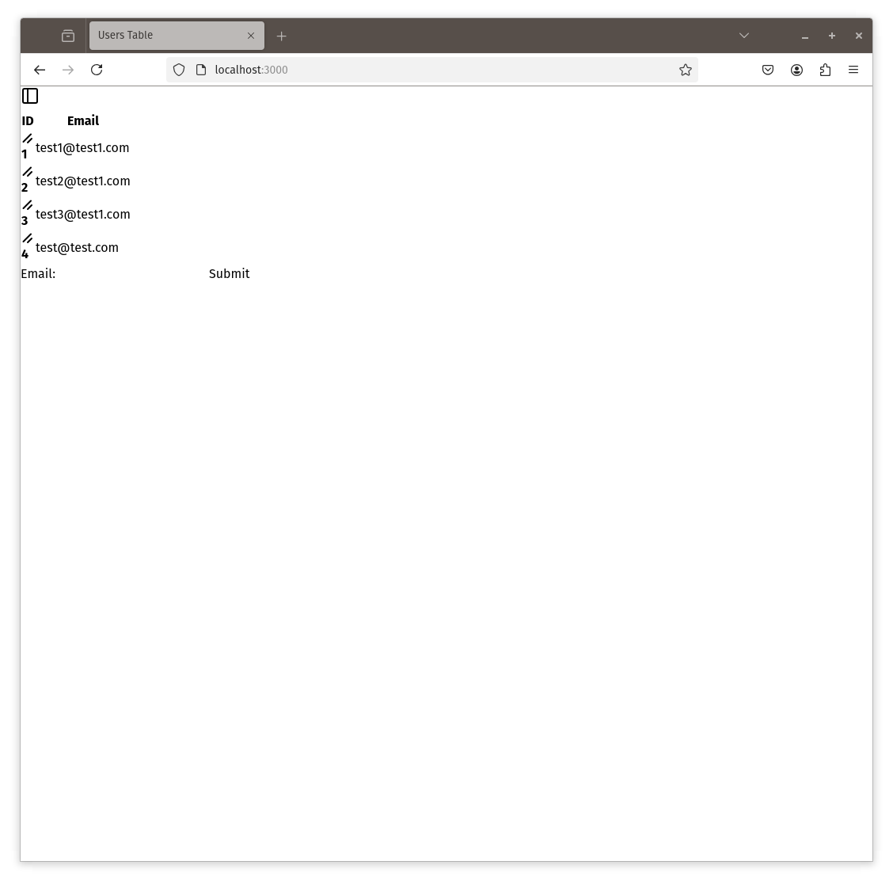

# Adding Some Style

You may have guessed by now if you looked at the layout we created that we're going to use [Tailwind](https://tailwindcss.com/) for styling.

We'll add this to our `web-assets` folder and then to our layout. We have pre-installed [tailwind-extra](https://github.com/dobicinaitis/tailwind-cli-extra) so we can use tailwind without creating an npm pipeline.

## Adding Tailwind

```sh
cd crates/web-assets
tailwind-extra init
```
This will create a `tailwind.config.js` file.

We also need to create a `input.css` file.


```css
@tailwind base;
@tailwind components;
@tailwind utilities;
```

## Watching Tailwind

Add the following to your ´Justfile´

```justfile
tailwind:
    cd /workspace/crates/web-assets && tailwind-extra -i ./input.css -o ./dist/tailwind.css --watch
```

Also create a `.gitignore` so that we don't include the dist folder in our repo.

```sh
dist
```

Now we can run 

```sh
just tailwind
```

The stylesheet will be compiled.

## Add the stylesheet to the layout

Update `crates/web-assets/build.rs` and add the `dist` folder to our static files.


```rust
let asset_dirs = vec![PathBuf::from("./images"), PathBuf::from("./dist")];
```

Update `crates/web-pages/src/layout.rs` and change the stylesheets entry.

```rust
stylesheets: vec![web_assets::files::tailwind_css.name.to_string()],
```

## With Tailwind

We're nearly there. Our app is now using tailwind.

